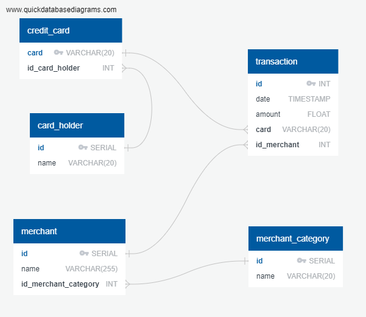
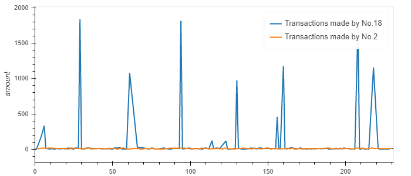
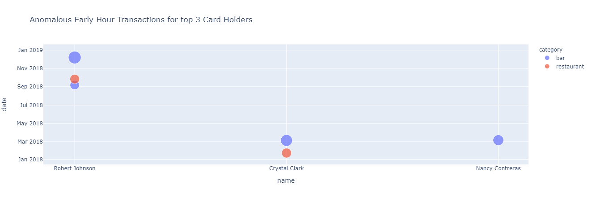

# Unit 7 Homework Assignment: Looking for Suspicious Transactions

*[Credit Card Fraudster by Richard Patterson](https://www.flickr.com/photos/136770128@N07/42252105582/) | [Creative Commons Licensed](https://creativecommons.org/licenses/by/2.0/)*

## Background

Fraud is everywhere these days—whether you are a small taco shop or a large international business. While there are emerging technologies that employ machine learning and artificial intelligence to detect fraud, many instances of fraud detection still require strong data analytics to find abnormal charges.

In this homework assignment, you will apply your new SQL skills to analyze historical credit card transactions and consumption patterns in order to identify possible fraudulent transactions.

You are asked to accomplish three main tasks:

1. [Data Modeling](#Data-Modeling):
Define a database model to store the credit card transactions data and create a new PostgreSQL database using your model.

2. [Data Engineering](#Data-Engineering): Create a database schema on PostgreSQL and populate your database from the CSV files provided.

3. [Data Analysis](#Data-Analysis): Analyze the data to identify possible fraudulent transactions.

---

## Files

* [card_holder.csv](Data/card_holder.csv)
* [credit_card.csv](Data/credit_card.csv)
* [merchant_category.csv](Data/merchant_category.csv)
* [merchant.csv](Data/merchant.csv)
* [transaction.csv](Data/transaction.csv)

### Data Modeling

Following image is the Entry Relationship Diagram (ERD) for storing the transaction details.

### Data Analysis

Now that your data is prepared within the database, it's finally time to identify fraudulent transactions using SQL and Pandas DataFrames. In this part of the homework assignment, you will analyze the data and then create a report within a Jupyter Notebook file to present your findings. Your report should answer the following questions:

1. Report for fraudulent transactions of two of the most important customers of the firm

* __Observations__ : 'Cardholder 2 is suspicious because he made too many small trasactions and cardholder 18 made high amount anomaly trasactions'

2.  Report for The CEO of the firm's biggest customer suspecting that someone has used her corporate credit card without authorization in the first quarter of 2018 to pay for several expensive restaurant bills.

* __Observations__ : 'In the month of January, card holder number 25 spent $1,177 at a restaurant.\n'
    'Another outlier can be seen in March where the cardholder spent $1,334 at a bar.\n'
    'Other six separate outliers, three of each in the month of April and June can be seen spent at restaurant, bar, coffee shop and pub.\n'
    'Another concerning fraudulent activity is at a food truck where the cardholder paid $1046.'

## Challenge

### Identifying Outliers using Standard Deviation

